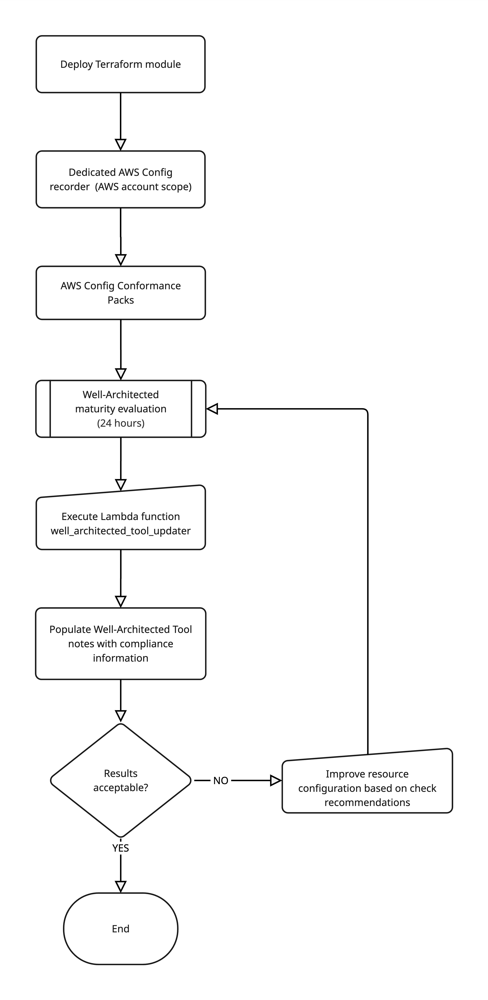
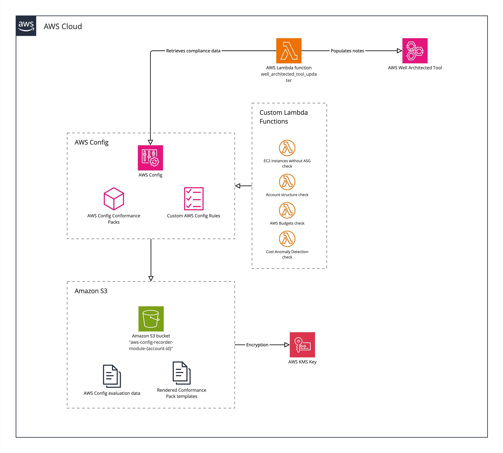
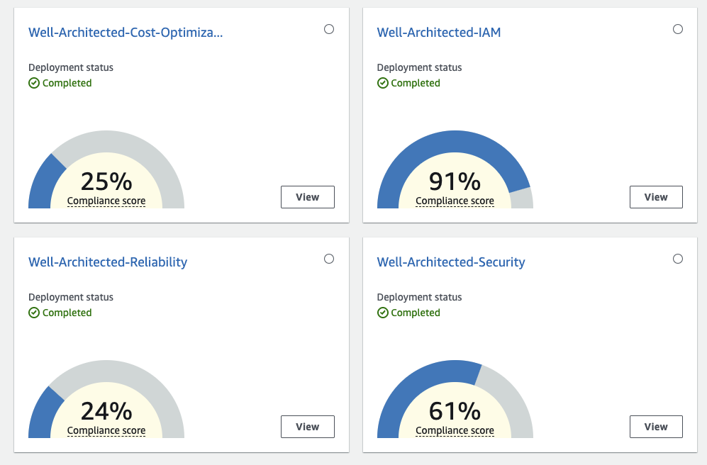
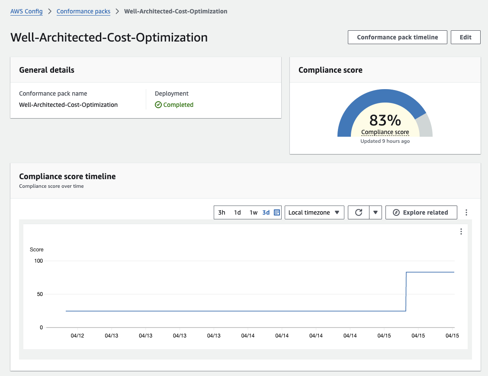
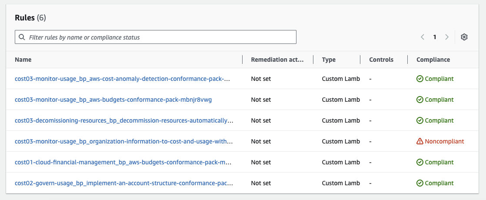
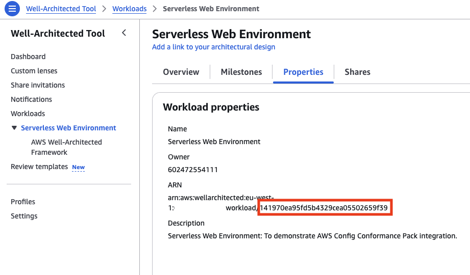
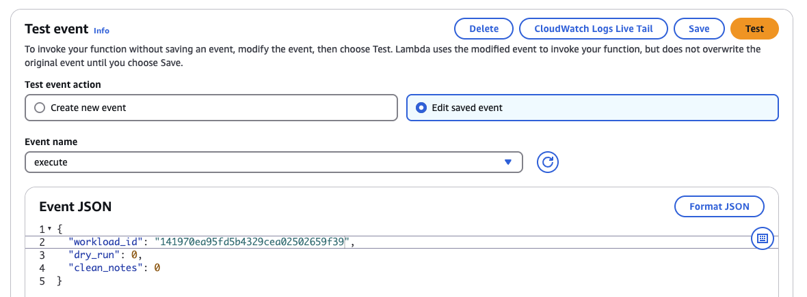
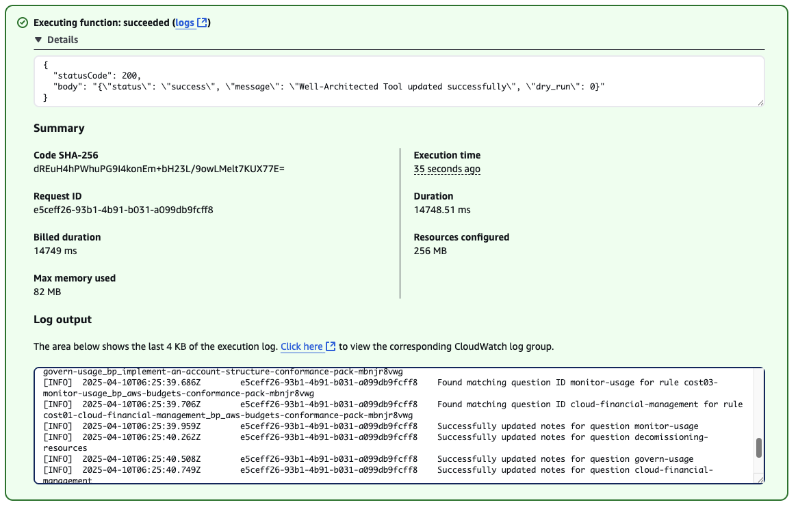
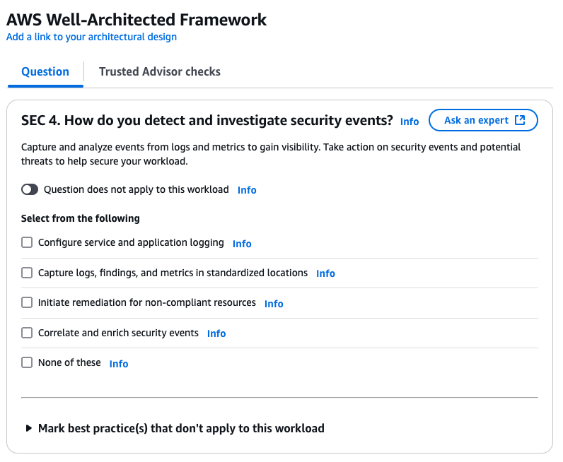
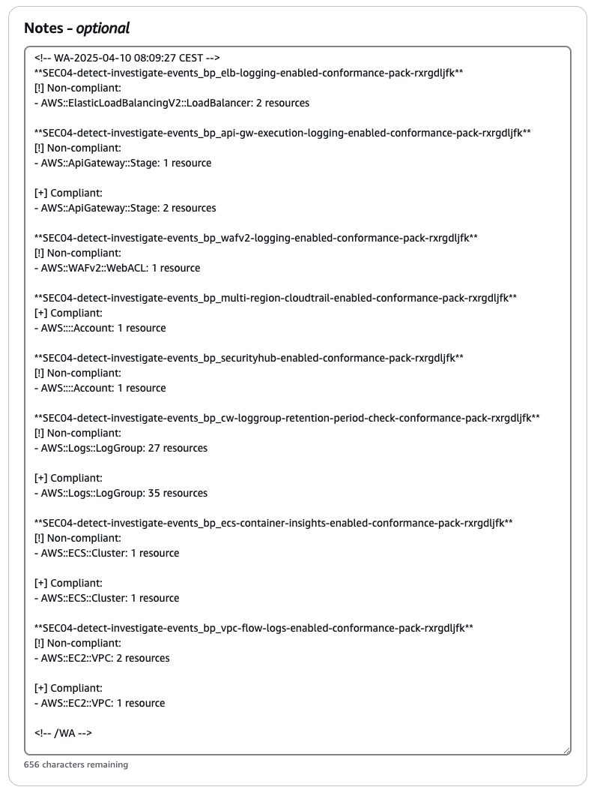

# terraform-aws-wellarchitected-conformance

# TL;DR
This Terraform module deploys AWS Config Conformance Packs mapped to pillars in the Well-Architected Framework.
A Lambda function can populate the Notes field in the Well-Architected Tool with AWS Config resource compliance check results.
Another Lambda function can generate HTML reports of compliance data and store them in an S3 bucket.






# About
Are you Well-Architected? How do you measure it, specifically?

The purpose of this Terraform module is to help you try to answer that question in the form of AWS Config Conformance Packs.
For relevant pillars in the [AWS Well-Architected Framework](https://docs.aws.amazon.com/wellarchitected/latest/framework/welcome.html), each best practice that is specific enough to be detected will report to be COMPLIANT or NON_COMPLIANT. Some best practices are harder to measure, or up to subjective consideration if a team is happy with how things are, or if the team considers there is room for improvement:
 - How a team evaluates culture and priorities.
 - How satisfied a team is with insight into their workload(s) or business continuity and disaster recovery planning.
 - How to practice cloud financial management.

Best practices in Operational Excellence are not straight forward to detect, as implementation of observability may have subjective opinion on room for improvement or may be performed with 3rd party tools.
The main outcome of this module is to accelerate the Well-Architected Framework Review conversation, not to replace it with automation. Our hope is to shift the focus from  "how did we configure this?" to "this is where we are today, what could we do to improve?", thus freeing up valuable time for busy teams.

## Use-case
If you can relate to some of these situations, this tool may be useful for you:
 - [AWS Security Hub](https://aws.amazon.com/security-hub/) with [AWS Foundational Security Best Practices](https://docs.aws.amazon.com/securityhub/latest/userguide/fsbp-standard.html) and/or [CIS AWS Foundations Benchmark](https://docs.aws.amazon.com/securityhub/latest/userguide/cis-aws-foundations-benchmark.html) are not available.
 - AWS Trusted Advisor checks based on AWS Business or Enterprise Support are not available.
 - 3rd party tools such as [Prowler](https://prowler.com/) and [Steampipe](https://steampipe.io/) are not approved by your company's security team.

 This Terraform module provisions AWS native services based on AWS Config, incl. a dedicated AWS Config Recorder, in addition to custom Lambda checks, in a standalone AWS Account.
 The full list of provisioned resources can be found further down in this README.

## AWS Config Conformance Pack mapping to Well-Architected Framework Pillar
### Available
 - Security Pillar: 128 checks
 - Reliability Pillar: 69 checks
 - Cost Optimization Pillar: 6 checks

### Not yet available
 - Operational Excellence Pillar
 - Performance Efficiency Pillar
 - Sustainability Pillar

Conformance pack Well-Architected-IAM is also available, as a subset of Security, for insight into that specific area. Do note that no automation is supported for the IAM pack, as it is covered in the Security pack.

## Well-Architected Tool Integration
This module provides two Lambda functions for integrating with the Well-Architected Tool:

### 1. Well-Architected Tool Updater
This Lambda function updates your Well-Architected Tool workload with compliance data from the AWS Config Conformance Packs.

The Lambda function will:
1. Process each conformance pack (Security, Reliability, Cost Optimization).
1. Loop through all rules in sequence (SEC01, SEC02, REL01, REL02, COST01, etc.).
1. For each rule, list the resource type, resource ID, and compliance status in the Notes field of the corresponding best practice question of your Well-Architected Tool workload.
1. Overwrite old data if triggered more than once. The notes field has a limitation of maximum 2084 characters.
1. If you would like to erase all contents in all notes field, set the clean_notes input parameter to 1.

The source code for the Lambda function is located in the [src/wa_tool_updater](src/wa_tool_updater) directory.

### 2. Well-Architected Report Generator
This Lambda function generates HTML reports from AWS Config compliance data and stores them in a dedicated S3 bucket.

The Lambda function will:
1. Process each conformance pack (Security, Reliability, Cost Optimization).
2. Retrieve question titles from the Well-Architected Tool API for more descriptive reports.
3. Collect compliance data for all rules (SEC01, SEC02, REL01, COST01, etc.).
4. Generate an HTML report with compliance scores, resource details, and visual progress bars.
5. Upload the report to a dedicated S3 bucket in the "Reports" folder.

The source code for the Lambda function is located in the [src/wa_report_generator](src/wa_report_generator) directory.

### Notice about compliance checks and automation
Check data is based on all resources in the current AWS account. Tagging based filtering is currently not supported. Be aware if you have multiple workloads in the same AWS account.


# Getting started
1. At least two days before your planned review, deploy the module as suggested in [examples/main.tf](examples/main.tf). Compliance checks will update on a daily basis, to reduce unncessary costs for AWS Config Evaluations.
1. Right before the review, trigger the Lambda functions manually through the AWS Console or CLI:

## Invoking the Lambda Functions

### Well-Architected Tool Updater
Extract the Well-Architected Tool Workload ID from Properties - ARN.
This example with dry_run set to 1 will find relevant compliance data and log to CloudWatch Logs. No changes or updates will be performed.
```json
{
  "workload_id": "141970ea95fd5b4329cea05202659f39",
  "dry_run": 1,
  "clean_notes": 0
}
```
Flipping dry_run to 0 will perform updates of the notes field. No checked/answered questions will be modified.
```json
{
  "workload_id": "141970ea95fd5b4329cea05202659f39",
  "dry_run": 0,
  "clean_notes": 0
}
```

To clean the notes field for all questions, set clean_notes to 1:
```json
{
  "workload_id": "141970ea95fd5b4329cea05202659f39",
  "dry_run": 1,
  "clean_notes": 1
}
```

### Well-Architected Report Generator
To generate an HTML report with compliance data, invoke the Lambda function with:
```json
{
  "workload_id": "141970ea95fd5b4329cea05202659f39",
  "dry_run": 0
}
```
The `workload_id` parameter is used to retrieve question titles from the Well-Architected Tool API, making the report more descriptive.

Setting `dry_run` to 1 will simulate the report generation without uploading to S3.

## Functionality

Navigating to AWS Config - Conformance packs will present a dashboard with packs for the Security, Reliability and Cost Optimization Pillars by default.



You can view the compliance score trend for each pillar/pack:



You can also view the compliance status for each check, prefixed with the related best practice question, mapped to the [AWS Well-Architected Framework whitepaper](https://docs.aws.amazon.com/wellarchitected/latest/framework/the-pillars-of-the-framework.html).



To trigger the Well-Architected Tool updater, go to Well-Architected Tool and extract the Workload ID (not the full resource ARN).



Then go to AWS Lambda and find the function well_architected_tool_updater. Create test event JSON definition as follows (Console or CLI):



Expected output is as follows. Full log output is available in Cloudwatch Logs.



Back in Well-Architected Tool, the notes field will be updated with detected compliance for SEC 4. How do you detect and investigate security events?






## Cost of AWS Config evaluations
According to the [AWS Config pricing page](https://aws.amazon.com/config/pricing/); With AWS Config, you are charged based on the number of configuration items recorded, the number of active AWS Config rule evaluations, and the number of conformance pack evaluations in your account. A configuration item is a record of the configuration state of a resource in your AWS account. An AWS Config rule evaluation is a compliance state evaluation of a resource by an AWS Config rule in your AWS account. A conformance pack evaluation is the evaluation of a resource by an AWS Config rule within the conformance pack.

AWS Config supports [Continuous recording and Daily recording](https://docs.aws.amazon.com/config/latest/developerguide/select-resources.html#select-resources-recording-frequency). Continuous recording allows you to record configuration changes continuously whenever a change occurs.

You can choose between Daily or Continuous by setting the desired value for the variable recording_frequency, which defaults to DAILY.

<!-- BEGIN_TF_DOCS -->
## Requirements

| Name | Version |
|------|---------|
| <a name="requirement_terraform"></a> [terraform](#requirement\_terraform) | ~> 1.9 |
| <a name="requirement_aws"></a> [aws](#requirement\_aws) | ~> 5 |
| <a name="requirement_util"></a> [util](#requirement\_util) | ~> 0.3.0 |

## Providers

| Name | Version |
|------|---------|
| <a name="provider_aws"></a> [aws](#provider\_aws) | ~> 5 |
| <a name="provider_http"></a> [http](#provider\_http) | n/a |
| <a name="provider_util"></a> [util](#provider\_util) | ~> 0.3.0 |

## Modules

| Name | Source | Version |
|------|--------|---------|
| <a name="module_aws_config_well_architected_recorder_s3_bucket"></a> [aws\_config\_well\_architected\_recorder\_s3\_bucket](#module\_aws\_config\_well\_architected\_recorder\_s3\_bucket) | git::https://github.com/terraform-aws-modules/terraform-aws-s3-bucket.git | 8a0b697adfbc673e6135c70246cff7f8052ad95a |
| <a name="module_lambda_function_wa_conformance_cost_02_account_structure_implemented"></a> [lambda\_function\_wa\_conformance\_cost\_02\_account\_structure\_implemented](#module\_lambda\_function\_wa\_conformance\_cost\_02\_account\_structure\_implemented) | git::https://github.com/terraform-aws-modules/terraform-aws-lambda.git | f7866811bc1429ce224bf6a35448cb44aa5155e7 |
| <a name="module_lambda_function_wa_conformance_cost_03_add_organization_information_to_cost_and_usage"></a> [lambda\_function\_wa\_conformance\_cost\_03\_add\_organization\_information\_to\_cost\_and\_usage](#module\_lambda\_function\_wa\_conformance\_cost\_03\_add\_organization\_information\_to\_cost\_and\_usage) | git::https://github.com/terraform-aws-modules/terraform-aws-lambda.git | f7866811bc1429ce224bf6a35448cb44aa5155e7 |
| <a name="module_lambda_function_wa_conformance_cost_03_aws_budgets"></a> [lambda\_function\_wa\_conformance\_cost\_03\_aws\_budgets](#module\_lambda\_function\_wa\_conformance\_cost\_03\_aws\_budgets) | git::https://github.com/terraform-aws-modules/terraform-aws-lambda.git | f7866811bc1429ce224bf6a35448cb44aa5155e7 |
| <a name="module_lambda_function_wa_conformance_cost_03_aws_cost_anomaly_detection"></a> [lambda\_function\_wa\_conformance\_cost\_03\_aws\_cost\_anomaly\_detection](#module\_lambda\_function\_wa\_conformance\_cost\_03\_aws\_cost\_anomaly\_detection) | git::https://github.com/terraform-aws-modules/terraform-aws-lambda.git | f7866811bc1429ce224bf6a35448cb44aa5155e7 |
| <a name="module_lambda_function_wa_conformance_cost_04_ec2_instances_without_auto_scaling"></a> [lambda\_function\_wa\_conformance\_cost\_04\_ec2\_instances\_without\_auto\_scaling](#module\_lambda\_function\_wa\_conformance\_cost\_04\_ec2\_instances\_without\_auto\_scaling) | git::https://github.com/terraform-aws-modules/terraform-aws-lambda.git | f7866811bc1429ce224bf6a35448cb44aa5155e7 |
| <a name="module_lambda_function_wa_report_generator"></a> [lambda\_function\_wa\_report\_generator](#module\_lambda\_function\_wa\_report\_generator) | git::https://github.com/terraform-aws-modules/terraform-aws-lambda.git | f7866811bc1429ce224bf6a35448cb44aa5155e7 |
| <a name="module_lambda_function_wa_tool_updater"></a> [lambda\_function\_wa\_tool\_updater](#module\_lambda\_function\_wa\_tool\_updater) | git::https://github.com/terraform-aws-modules/terraform-aws-lambda.git | f7866811bc1429ce224bf6a35448cb44aa5155e7 |
| <a name="module_wa_reports_s3_bucket"></a> [wa\_reports\_s3\_bucket](#module\_wa\_reports\_s3\_bucket) | git::https://github.com/terraform-aws-modules/terraform-aws-s3-bucket.git | 8a0b697adfbc673e6135c70246cff7f8052ad95a |

## Resources

| Name | Type |
|------|------|
| [aws_config_config_rule.cost_01_aws_budgets](https://registry.terraform.io/providers/hashicorp/aws/latest/docs/resources/config_config_rule) | resource |
| [aws_config_config_rule.cost_02_account_structure_implemented](https://registry.terraform.io/providers/hashicorp/aws/latest/docs/resources/config_config_rule) | resource |
| [aws_config_config_rule.cost_03_aws_budgets](https://registry.terraform.io/providers/hashicorp/aws/latest/docs/resources/config_config_rule) | resource |
| [aws_config_config_rule.cost_03_aws_cost_anomaly_detection](https://registry.terraform.io/providers/hashicorp/aws/latest/docs/resources/config_config_rule) | resource |
| [aws_config_config_rule.cost_03_organization_information_to_cost_and_usage](https://registry.terraform.io/providers/hashicorp/aws/latest/docs/resources/config_config_rule) | resource |
| [aws_config_config_rule.cost_04_decommission_resources_automatically](https://registry.terraform.io/providers/hashicorp/aws/latest/docs/resources/config_config_rule) | resource |
| [aws_config_configuration_recorder.well_architected](https://registry.terraform.io/providers/hashicorp/aws/latest/docs/resources/config_configuration_recorder) | resource |
| [aws_config_configuration_recorder_status.well_architected](https://registry.terraform.io/providers/hashicorp/aws/latest/docs/resources/config_configuration_recorder_status) | resource |
| [aws_config_conformance_pack.well_architected_conformance_pack_cost_optimization](https://registry.terraform.io/providers/hashicorp/aws/latest/docs/resources/config_conformance_pack) | resource |
| [aws_config_conformance_pack.well_architected_conformance_pack_iam](https://registry.terraform.io/providers/hashicorp/aws/latest/docs/resources/config_conformance_pack) | resource |
| [aws_config_conformance_pack.well_architected_conformance_pack_reliability](https://registry.terraform.io/providers/hashicorp/aws/latest/docs/resources/config_conformance_pack) | resource |
| [aws_config_conformance_pack.well_architected_conformance_pack_security](https://registry.terraform.io/providers/hashicorp/aws/latest/docs/resources/config_conformance_pack) | resource |
| [aws_config_delivery_channel.well_architected](https://registry.terraform.io/providers/hashicorp/aws/latest/docs/resources/config_delivery_channel) | resource |
| [aws_config_retention_configuration.well_architected](https://registry.terraform.io/providers/hashicorp/aws/latest/docs/resources/config_retention_configuration) | resource |
| [aws_iam_role.config_role](https://registry.terraform.io/providers/hashicorp/aws/latest/docs/resources/iam_role) | resource |
| [aws_iam_role_policy.config_policy_well_architected_recorder](https://registry.terraform.io/providers/hashicorp/aws/latest/docs/resources/iam_role_policy) | resource |
| [aws_iam_role_policy_attachment.config_role_attachment](https://registry.terraform.io/providers/hashicorp/aws/latest/docs/resources/iam_role_policy_attachment) | resource |
| [aws_kms_alias.wa_reports_kms_alias](https://registry.terraform.io/providers/hashicorp/aws/latest/docs/resources/kms_alias) | resource |
| [aws_kms_key.aws_config_well_architected_recorder_s3_bucket](https://registry.terraform.io/providers/hashicorp/aws/latest/docs/resources/kms_key) | resource |
| [aws_kms_key.wa_reports_kms_key](https://registry.terraform.io/providers/hashicorp/aws/latest/docs/resources/kms_key) | resource |
| [aws_lambda_permission.config_permissions](https://registry.terraform.io/providers/hashicorp/aws/latest/docs/resources/lambda_permission) | resource |
| [aws_s3_object.cloudformation_wa_config_cost_optimization_template](https://registry.terraform.io/providers/hashicorp/aws/latest/docs/resources/s3_object) | resource |
| [aws_s3_object.cloudformation_wa_config_iam_template](https://registry.terraform.io/providers/hashicorp/aws/latest/docs/resources/s3_object) | resource |
| [aws_s3_object.cloudformation_wa_config_reliability_template](https://registry.terraform.io/providers/hashicorp/aws/latest/docs/resources/s3_object) | resource |
| [aws_s3_object.cloudformation_wa_config_security_template](https://registry.terraform.io/providers/hashicorp/aws/latest/docs/resources/s3_object) | resource |
| [aws_caller_identity.current](https://registry.terraform.io/providers/hashicorp/aws/latest/docs/data-sources/caller_identity) | data source |
| [aws_iam_policy_document.config_policy_well_architected_recorder](https://registry.terraform.io/providers/hashicorp/aws/latest/docs/data-sources/iam_policy_document) | data source |
| [aws_iam_policy_document.well_architected_config_assume_role](https://registry.terraform.io/providers/hashicorp/aws/latest/docs/data-sources/iam_policy_document) | data source |
| [aws_region.current](https://registry.terraform.io/providers/hashicorp/aws/latest/docs/data-sources/region) | data source |
| [http_http.template_body_wa_iam_pillar](https://registry.terraform.io/providers/hashicorp/http/latest/docs/data-sources/http) | data source |
| [http_http.template_body_wa_reliability_pillar](https://registry.terraform.io/providers/hashicorp/http/latest/docs/data-sources/http) | data source |
| [http_http.template_body_wa_security_pillar](https://registry.terraform.io/providers/hashicorp/http/latest/docs/data-sources/http) | data source |
| [util_replace.transformed_wa_reliability_pillar](https://registry.terraform.io/providers/poseidon/util/latest/docs/data-sources/replace) | data source |
| [util_replace.transformed_wa_security_pillar](https://registry.terraform.io/providers/poseidon/util/latest/docs/data-sources/replace) | data source |

## Inputs

| Name | Description | Type | Default | Required |
|------|-------------|------|---------|:--------:|
| <a name="input_aws_config_retention_period_in_days"></a> [aws\_config\_retention\_period\_in\_days](#input\_aws\_config\_retention\_period\_in\_days) | Number of days AWS Config stores your historical information. | `number` | `180` | no |
| <a name="input_cost_optimization_conformance_pack_name"></a> [cost\_optimization\_conformance\_pack\_name](#input\_cost\_optimization\_conformance\_pack\_name) | Name of the Cost Optimization conformance pack | `string` | `"Well-Architected-Cost-Optimization"` | no |
| <a name="input_deploy_aws_config_recorder"></a> [deploy\_aws\_config\_recorder](#input\_deploy\_aws\_config\_recorder) | Set to true to deploy an AWS Config Recorder. If you already have a customer managed AWS Config recorder in the desired region, set to false. AWS supports only one customer managed configuration recorder for each account for each AWS Region. | `bool` | `true` | no |
| <a name="input_deploy_cost_optimization_conformance_pack"></a> [deploy\_cost\_optimization\_conformance\_pack](#input\_deploy\_cost\_optimization\_conformance\_pack) | Deploy AWS Config Conformance Pack for Cost Optimization. | `bool` | `true` | no |
| <a name="input_deploy_iam_conformance_pack"></a> [deploy\_iam\_conformance\_pack](#input\_deploy\_iam\_conformance\_pack) | Deploy AWS Config Conformance Pack for IAM. | `bool` | `false` | no |
| <a name="input_deploy_reliability_conformance_pack"></a> [deploy\_reliability\_conformance\_pack](#input\_deploy\_reliability\_conformance\_pack) | Deploy AWS Config Conformance Pack for Reliability. | `bool` | `true` | no |
| <a name="input_deploy_security_conformance_pack"></a> [deploy\_security\_conformance\_pack](#input\_deploy\_security\_conformance\_pack) | Deploy AWS Config Conformance Pack for Security. | `bool` | `true` | no |
| <a name="input_lambda_cloudwatch_logs_retention_in_days"></a> [lambda\_cloudwatch\_logs\_retention\_in\_days](#input\_lambda\_cloudwatch\_logs\_retention\_in\_days) | AWS Config Custom Lambda CloudWatch Logs retention in days. | `number` | `90` | no |
| <a name="input_lambda_log_level"></a> [lambda\_log\_level](#input\_lambda\_log\_level) | Lambda log level. Valid values [DEBUG,INFO,WARNING,ERROR]. | `string` | `"INFO"` | no |
| <a name="input_lambda_python_runtime"></a> [lambda\_python\_runtime](#input\_lambda\_python\_runtime) | Runtime for AWS Config Custom Lambda. | `string` | `"python3.12"` | no |
| <a name="input_lambda_timeout"></a> [lambda\_timeout](#input\_lambda\_timeout) | Timeout for AWS Config Custom Lambda in seconds. | `number` | `300` | no |
| <a name="input_lambda_timezone"></a> [lambda\_timezone](#input\_lambda\_timezone) | Timezone for Lambda functions. Uses pytz timezone names. Default is Europe/Paris (Central European Time). | `string` | `"Europe/Paris"` | no |
| <a name="input_recording_frequency"></a> [recording\_frequency](#input\_recording\_frequency) | AWS Config Recording Frequency. Valid options: DAILY or CONTINUOUS. | `string` | `"DAILY"` | no |
| <a name="input_reliability_conformance_pack_name"></a> [reliability\_conformance\_pack\_name](#input\_reliability\_conformance\_pack\_name) | Name of the Reliability conformance pack | `string` | `"Well-Architected-Reliability"` | no |
| <a name="input_reports_bucket_name_prefix"></a> [reports\_bucket\_name\_prefix](#input\_reports\_bucket\_name\_prefix) | Prefix for the S3 bucket name that stores Well-Architected compliance reports | `string` | `"well-architected-compliance-reports"` | no |
| <a name="input_reports_retention_days"></a> [reports\_retention\_days](#input\_reports\_retention\_days) | Number of days to retain non-current versions of reports in the S3 bucket | `number` | `90` | no |
| <a name="input_scheduled_config_custom_lambda_periodic_trigger_interval"></a> [scheduled\_config\_custom\_lambda\_periodic\_trigger\_interval](#input\_scheduled\_config\_custom\_lambda\_periodic\_trigger\_interval) | AWS Config Custom Lambda Periodic Trigger Interval. Default value of Twelve\_Hours ensures updates within the DAILY window. Valid Values: One\_Hour \| Three\_Hours \| Six\_Hours \| Twelve\_Hours \| TwentyFour\_Hours | `string` | `"Twelve_Hours"` | no |
| <a name="input_security_conformance_pack_name"></a> [security\_conformance\_pack\_name](#input\_security\_conformance\_pack\_name) | Name of the Security conformance pack | `string` | `"Well-Architected-Security"` | no |

## Outputs

| Name | Description |
|------|-------------|
| <a name="output_well_architected_conformance_pack_cost_optimization_arn"></a> [well\_architected\_conformance\_pack\_cost\_optimization\_arn](#output\_well\_architected\_conformance\_pack\_cost\_optimization\_arn) | n/a |
| <a name="output_well_architected_conformance_pack_iam_arn"></a> [well\_architected\_conformance\_pack\_iam\_arn](#output\_well\_architected\_conformance\_pack\_iam\_arn) | n/a |
| <a name="output_well_architected_conformance_pack_reliability_arn"></a> [well\_architected\_conformance\_pack\_reliability\_arn](#output\_well\_architected\_conformance\_pack\_reliability\_arn) | n/a |
| <a name="output_well_architected_conformance_pack_security_arn"></a> [well\_architected\_conformance\_pack\_security\_arn](#output\_well\_architected\_conformance\_pack\_security\_arn) | n/a |
| <a name="output_well_architected_report_generator_lambda_function_arn"></a> [well\_architected\_report\_generator\_lambda\_function\_arn](#output\_well\_architected\_report\_generator\_lambda\_function\_arn) | ARN of the Well-Architected Report Generator Lambda function |
| <a name="output_well_architected_report_generator_lambda_function_name"></a> [well\_architected\_report\_generator\_lambda\_function\_name](#output\_well\_architected\_report\_generator\_lambda\_function\_name) | Name of the Well-Architected Report Generator Lambda function |
| <a name="output_well_architected_reports_s3_bucket_arn"></a> [well\_architected\_reports\_s3\_bucket\_arn](#output\_well\_architected\_reports\_s3\_bucket\_arn) | ARN of the S3 bucket for Well-Architected compliance reports |
| <a name="output_well_architected_reports_s3_bucket_name"></a> [well\_architected\_reports\_s3\_bucket\_name](#output\_well\_architected\_reports\_s3\_bucket\_name) | Name of the S3 bucket for Well-Architected compliance reports |
<!-- END_TF_DOCS -->

**Note**: The inputs and outputs sections are automatically generated by terraform-docs in a git pre-commit hook. This requires setup of [pre-commit-terraform](https://github.com/antonbabenko/pre-commit-terraform) . Follow the install instructions to use, including the dependencies setup. pre-commit ensures correct formatting, linting and generation of documentation. It also check's for trailing whitespace, merge conflics and mixed line endings. See [.pre-commit-config.yaml](./.pre-commit-config.yaml) for more information. A full guide to the pre-commit framework can be found [here](https://pre-commit.com/).


## Authors/contributors
Developed and maintained by Well-Architected enthusiasts in Sopra Steria, without official company support nor liabilities. See [contributors.](https://github.com/soprasteria/terraform-aws-wellarchitected-conformance/graphs/contributors)
Accelerated by Amazon Q Developer.


## License
MIT licensed. For licensing information and disclaimer see [LICENSE.md](LICENSE.md).